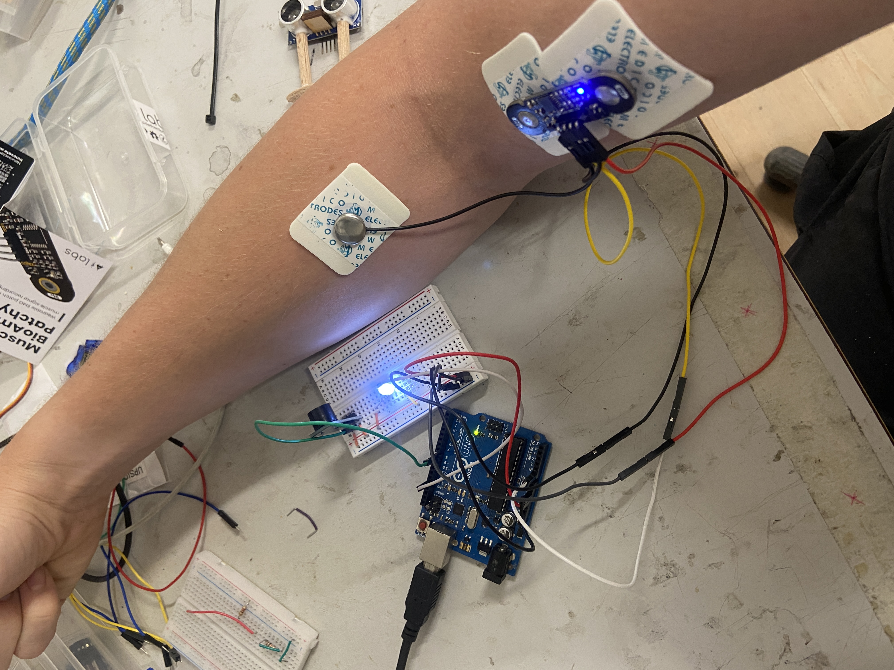

# EMG-LED-BUZZER-FEATURE
IoT Device; EMG Patch muscle flex input to control LED or Buzzer.
# EMG Patch Prototype: A Novel Muscle-Controlled Interaction Method

## Introduction
Welcome to the EMG Patch Prototype repository! This project explores the integration of an EMG (Electromyography) patch with various actuators to create a cutting-edge muscle-controlled interaction method. As a seasoned HCI researcher specializing in novel interaction methods, I aim to demonstrate the potential of using muscle flexion to sense user input and produce intuitive outputs.

## Functionality
The EMG patch, strategically attached to the bicep and brachioradialis muscles, serves as a reliable sensor for capturing muscle flexion. By analyzing the signal generated by the EMG patch, we can precisely detect single presses and double presses, resulting in distinct and meaningful outputs. Currently, these outputs are mapped to the activation of an LED or a buzzer, providing immediate feedback to the user.

## Calibration
To ensure accurate muscle flexion detection, careful calibration is required. Through extensive experimentation and analysis, I have determined that the EMG patch's analog input evens out at approximately 500 within the 0-1024 range. Based on this finding, a threshold of emgValue > 560 has been set, tailored to the fidelity of the specific EMG patch utilized. It's important to note that individual variations in physiology may necessitate personalized calibration for optimal performance.

## Known Challenges and Observations
As an HCI researcher, I am keenly aware of the practical limitations and challenges associated with novel interaction methods. During the development and testing of the EMG patch prototype, several issues were encountered:

1. Build quality concerns: The EMG patch's construction could have been improved for enhanced usability and robustness. Precise placement of the patch can be challenging, impacting its ability to accurately detect all intended inputs.

2. False positive readings: Occasionally, the EMG patch produces erroneous readings, leading to false positive triggers of the buzzer. This highlights the importance of refining the signal processing algorithms and noise reduction techniques.

3. Involuntary movements and twitches: Throughout the experiment, involuntary movements and muscle twitches have been observed, inadvertently triggering the buzzer. Addressing this issue requires further investigation and refining the system's filtering mechanisms.

## Future Directions
In future experiments, I plan to invest in a higher quality EMG sensor to achieve greater precision and accuracy in muscle flexion detection. By collaborating with experts in the field, I aim to refine the design, address the identified challenges, and explore new possibilities for muscle-controlled interaction.

Your feedback and contributions to this project are greatly appreciated as we collectively strive to push the boundaries of human-computer interaction.

